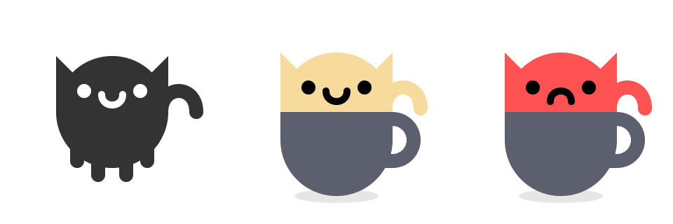

A while ago, I illustrated a simple cat graphic as an exercise to get familiar with [Figma](https://figma.com) and working with vectors.
It wasn't until years later that I fumbled across an idea where I could make use of it.

The idea was to create a game using the same mechanics of [Neighbours by EYEZMAZE](https://www.eyezmaze.com/sp/2007/02/neighboursV0.html).
The game presents you with a grid of cups and a matching number of cats.
Your goal is to arrange all of the cats in cups such that every cat is content with the adjacent cats, but this isn't as simple as it sounds.
Each cat is friendly with only a few others, and since the number of cups is limited, the game becomes a process of deduction.

If you're not familiar, Neighbours is a game created by indie game developer [EYEZMAZE](https://www.eyezmaze.com/sp/).
Their games are incredibly creative and original.
If you liked my game (or even if you didn't), I highly recommend you go check out his work.
